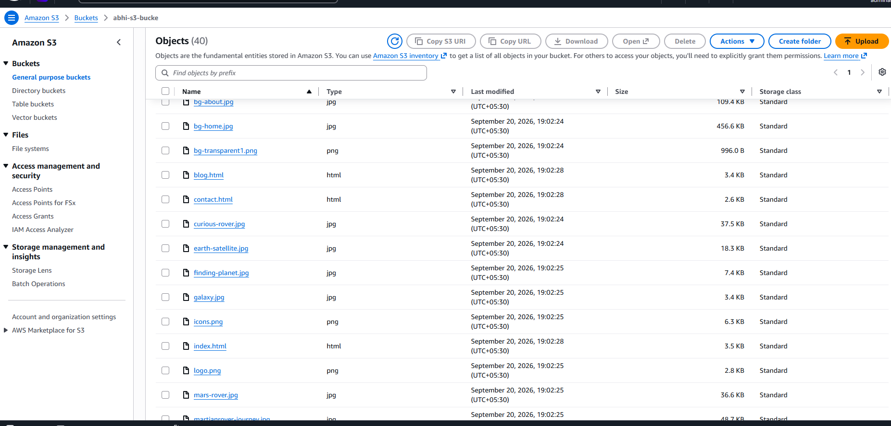
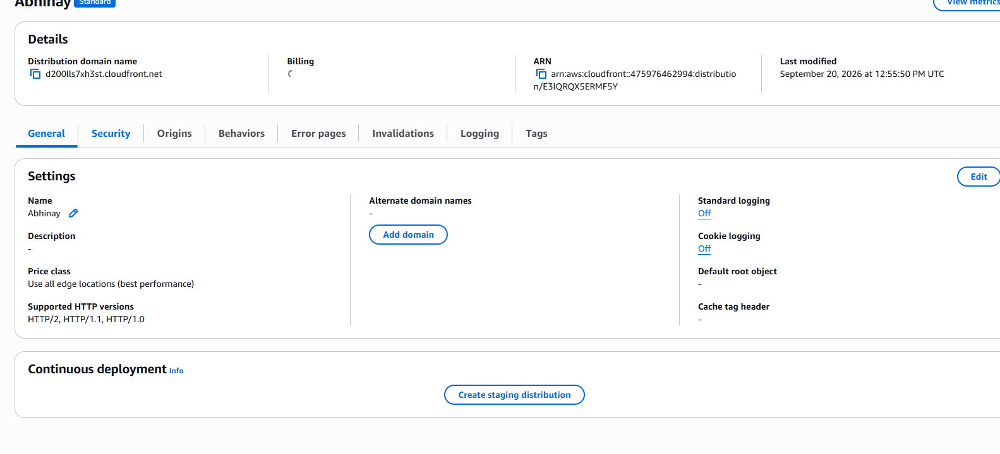
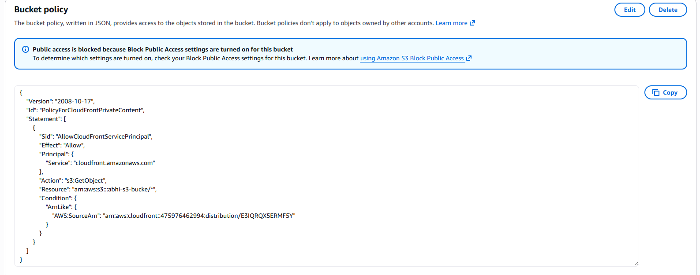
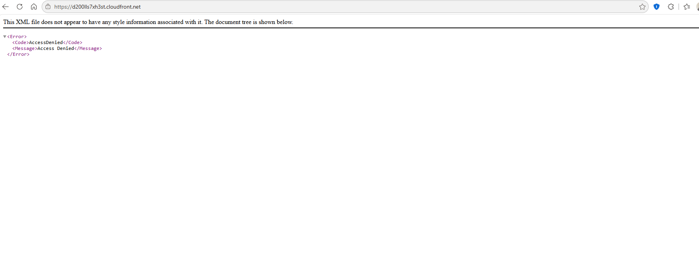
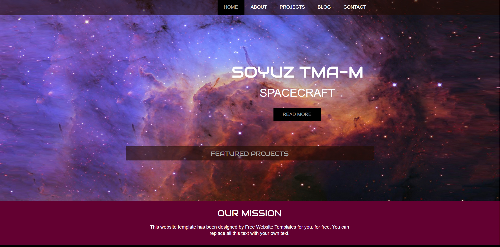
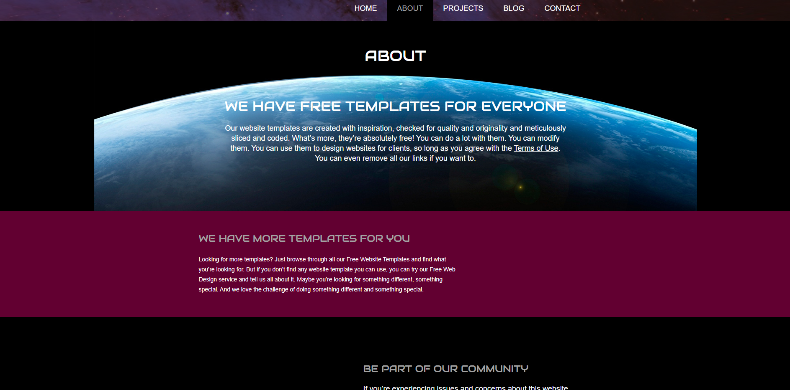
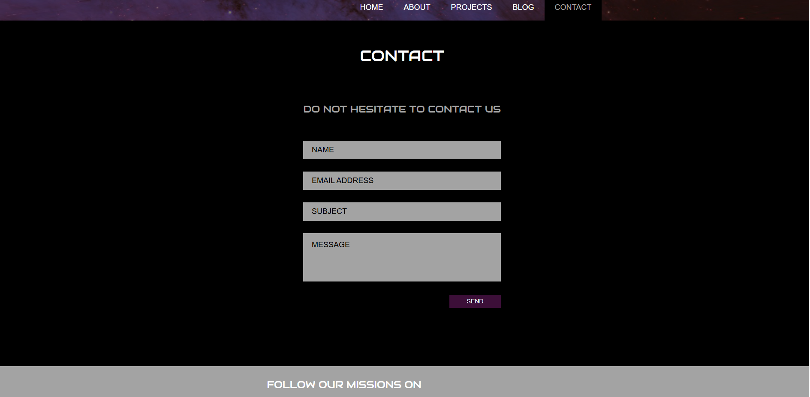
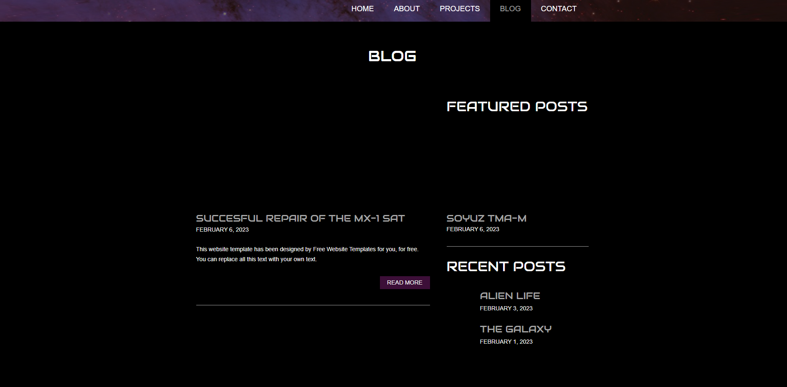

# AWS S3 + CloudFront Static Website


## 📌 Project Overview

This project demonstrates how I deployed a **static HTML website on Amazon S3 and delivered it globally through Amazon CloudFront**.

The website contains multiple HTML pages, CSS, JavaScript, images, and web fonts. The files are stored in an Amazon S3 bucket and served through a CloudFront distribution.

The project also demonstrates the configuration of **CloudFront Origin Access Control (OAC)** so that CloudFront can securely retrieve objects from the S3 bucket while direct public access to the bucket remains blocked.

### 🌐 Live Website

**CloudFront Distribution:**

`https://d200lls7xh3st.cloudfront.net`

> The CloudFront URL above is the distribution endpoint used for this project.

---

## 🏗️ Architecture

```text
                         Internet / Users
                                |
                                v
                    +-----------------------+
                    |   Amazon CloudFront   |
                    |   Global CDN / HTTPS  |
                    +-----------+-----------+
                                |
                         Origin Access
                           Control (OAC)
                                |
                                v
                    +-----------------------+
                    |       Amazon S3       |
                    |   Static Website Files|
                    +-----------+-----------+
                                |
              +-----------------+-----------------+
              |                 |                 |
           HTML files        CSS / JS         Images / Fonts
```

### Request Flow

1. A user opens the CloudFront URL.
2. CloudFront receives the request from the user.
3. CloudFront checks its cache for the requested object.
4. If the object is not available in cache, CloudFront requests it from S3.
5. CloudFront uses **Origin Access Control (OAC)** to authenticate with S3.
6. S3 returns the requested object to CloudFront.
7. CloudFront delivers the content to the user.

---

## ☁️ AWS Services Used

| Service | Purpose |
|---|---|
| **Amazon S3** | Stores the static website files |
| **Amazon CloudFront** | CDN used to distribute the website globally |
| **CloudFront OAC** | Allows CloudFront to securely access the private S3 bucket |
| **S3 Bucket Policy** | Grants `s3:GetObject` permission to the CloudFront distribution |

---

## 📂 Website Files

The website contains the following main components:

```text
.
├── index.html
├── about.html
├── blog.html
├── contact.html
├── proj1.html
├── projects.html
├── singlepost.html
│
├── css/
│   ├── style.css
│   └── mobile.css
│
├── js/
│   └── mobile.js
│
├── fonts/
│   ├── audiowide-regular-webfont.eot
│   ├── audiowide-regular-webfont.svg
│   ├── audiowide-regular-webfont.ttf
│   └── audiowide-regular-webfont.woff
│
└── images/
    ├── alien-life.jpg
    ├── astronaut.jpg
    ├── bg-about.jpg
    ├── bg-home.jpg
    ├── curious-rover.jpg
    ├── earth-satellite.jpg
    ├── finding-planet.jpg
    ├── galaxy.jpg
    ├── logo.png
    ├── mars-rover.jpg
    ├── moon-landing.jpg
    ├── satellite.png
    └── other website images
```

---

# 🚀 Implementation Steps

## Step 1 — Create the S3 Bucket

I created an Amazon S3 bucket to store the static website files.

Example bucket:

```text
abhi-s3-bucke
```

The website files were uploaded to the root of the bucket so that the HTML, CSS, JavaScript, image, and font paths could be resolved correctly.

### Files uploaded to S3

- HTML pages
- CSS files
- JavaScript files
- Images
- Web fonts

📸 **S3 Bucket Objects**



---

## Step 2 — Configure CloudFront

I created an Amazon CloudFront distribution and configured the S3 bucket as the origin.

CloudFront provides:

- Global content delivery
- HTTPS access
- Edge caching
- Reduced latency
- Secure access to the S3 origin

The CloudFront distribution created for this project is available at:

```text
https://d200lls7xh3st.cloudfront.net
```

📸 **CloudFront Distribution Settings**



---

## Step 3 — Configure Origin Access Control (OAC)

For security, the S3 bucket is not directly exposed to the public internet.

CloudFront uses **Origin Access Control (OAC)** to access objects stored in S3.

The bucket policy allows the CloudFront service principal to perform:

```text
s3:GetObject
```

for objects inside the bucket.

The policy is restricted to the specific CloudFront distribution using the AWS source ARN condition.

📸 **S3 Bucket Policy with CloudFront OAC**



---

## Step 4 — Configure Default Root Object

The main page of the website is:

```text
index.html
```

CloudFront should use `index.html` as the default root object so that a request to:

```text
https://d200lls7xh3st.cloudfront.net/
```

loads the homepage.

---

## Step 5 — Troubleshooting AccessDenied

During the initial configuration, I received an S3 `AccessDenied` error when accessing the CloudFront distribution.

📸 **Initial AccessDenied Error**



### Cause

The CloudFront distribution did not initially have the required permission to retrieve objects from the S3 bucket.

### Resolution

I configured the S3 bucket policy to allow the CloudFront distribution to access the objects using Origin Access Control.

After correcting the permissions and updating CloudFront, the website became accessible through the CloudFront domain.

---

# 🖥️ Website Validation

After completing the S3 and CloudFront configuration, I tested the different pages of the website through the CloudFront URL.

## Home Page



The homepage successfully loads the background images, navigation menu, text, and other website content.

## About Page



The About page loads successfully through CloudFront with its associated CSS and images.

## Contact Page



The Contact page loads successfully with the page layout and form elements.

## Blog Page



The Blog page also loads successfully through the CloudFront distribution.

---

# 🔐 Security Configuration

The project uses the following security approach:

- S3 bucket public access is blocked.
- CloudFront is used as the public entry point.
- CloudFront Origin Access Control is configured.
- S3 bucket policy grants CloudFront permission to read objects.
- Users access the website through the CloudFront distribution rather than directly accessing the S3 bucket.

### Security Model

```text
Public User
    |
    v
CloudFront
    |
    | OAC authenticated request
    v
Private S3 Bucket
```

---

# 🧪 Testing Performed

The following tests were performed after deployment:

- [x] S3 objects uploaded successfully
- [x] CloudFront distribution created
- [x] S3 configured as CloudFront origin
- [x] Origin Access Control configured
- [x] S3 bucket policy configured
- [x] `index.html` tested through CloudFront
- [x] CSS files tested
- [x] JavaScript files tested
- [x] Images tested
- [x] Multiple HTML pages tested
- [x] CloudFront URL tested from browser
- [x] Initial `AccessDenied` issue identified and resolved

---

# 📚 What I Learned

Through this project, I gained practical experience with:

### Amazon S3

- Creating S3 buckets
- Uploading static website files
- Organizing website assets
- Understanding S3 object access
- Understanding Block Public Access
- Working with S3 bucket policies

### Amazon CloudFront

- Creating a CloudFront distribution
- Configuring an S3 origin
- Understanding CDN and edge caching
- Configuring Origin Access Control
- Configuring the default root object
- Testing CloudFront distributions
- Troubleshooting `AccessDenied` errors

### AWS Security

- Understanding why public S3 access should not be required when using CloudFront OAC
- Using IAM-style resource policies to control S3 access
- Restricting S3 access to a specific CloudFront distribution

---

# 🛠️ Troubleshooting Notes

## Issue 1 — AccessDenied

**Symptom:**

```text
<Code>AccessDenied</Code>
<Message>Access Denied</Message>
```

**Solution:**

Configured the S3 bucket policy to allow the CloudFront distribution to perform `s3:GetObject` through Origin Access Control.

---

## Issue 2 — Website Loads Without CSS

**Symptom:**

The HTML page opened, but the CSS/images were missing.

**Checks performed:**

1. Confirmed the CSS file existed in S3.
2. Confirmed the folder structure matched the paths used by the HTML files.
3. Checked browser requests for missing objects.
4. Confirmed CloudFront could retrieve the required objects.
5. Invalidated CloudFront cache after configuration/file changes.

Example:

```text
/css/style.css
/css/mobile.css
/js/mobile.js
/images/bg-home.jpg
```

---

## Issue 3 — Homepage Not Loading

The homepage depends on:

```text
index.html
```

The CloudFront distribution was configured to use `index.html` as the default root object.

---

# 🔄 Future Improvements

Possible improvements for this project include:

- Add a custom domain using Route 53
- Add an SSL/TLS certificate using AWS Certificate Manager
- Configure HTTPS with a custom domain
- Add CloudFront custom error pages
- Add CloudFront cache policies
- Add response headers policies
- Add AWS WAF for additional web protection
- Automate deployment using GitHub Actions
- Add CI/CD from GitHub to S3 and CloudFront
- Add CloudWatch monitoring and alarms
- Configure logging for CloudFront

---

# 📌 Project Summary

This project demonstrates a complete AWS static website hosting workflow:

```text
Website Files
     |
     v
Amazon S3
     |
     | S3 Origin
     v
Amazon CloudFront
     |
     | OAC
     v
Secure S3 Object Access
     |
     v
Global Website Delivery
```

The project helped me understand how **Amazon S3, CloudFront, Origin Access Control, S3 bucket policies, caching, and static website assets work together in a real AWS deployment.**

---

## 👨‍💻 Author

**Abhinay Kumar**

AWS Cloud / Infrastructure Learning Projects

---

## ⭐ If you find this project useful

Feel free to explore the repository and review the AWS configuration and deployment screenshots.

